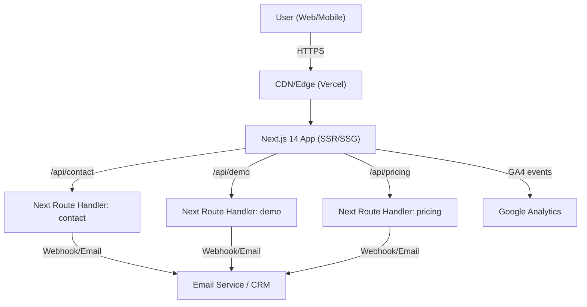
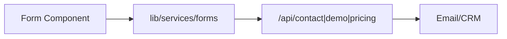
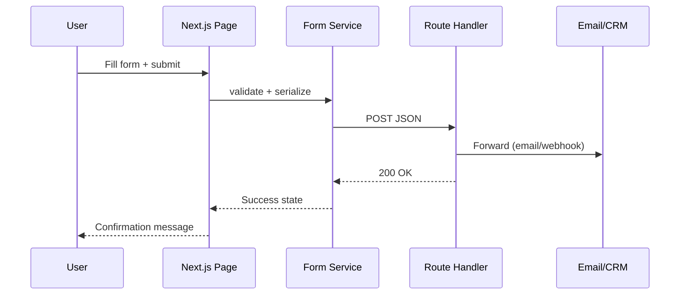
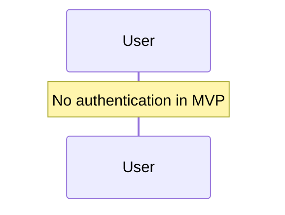
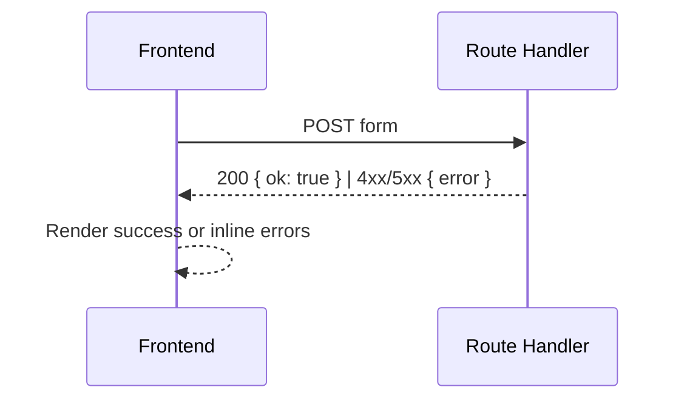

# Kryohm Website Fullstack Architecture Document

## Introduction
This document outlines the complete fullstack architecture for the Kryohm Website, including frontend implementation, lightweight backend endpoints, and their integration. It is the single source of truth for AI-driven development and ensures consistency with the PRD and Front-End Spec. The solution prioritizes performance, accessibility, SEO, and conversion optimization for lead generation.

- Starter Template or Existing Project: N/A – Greenfield project

### Change Log
| Date | Version | Description | Author |
|------|---------|-------------|--------|
| 2025-08-24 | 0.1 | Initial architecture draft aligned to PRD/spec | Architect |

---

## High Level Architecture

### Technical Summary
- Next.js 14 (App Router) with React 18 and TypeScript as a single web app, deployed on an edge-optimized platform.
- Monolith within Next.js: content-driven pages, static generation with incremental revalidation; minimal server-side route handlers for forms.
- Integration points: frontend forms call internal API routes which forward to an email service (initial phase); CRM webhook optional in a later phase; analytics via GA4 with consent gating.
- Hosting on Vercel for global CDN/edge, image optimization, and zero-config CI/CD.
- Meets PRD goals: fast loads (<3s), WCAG AA, strong SEO, and conversion-focused lead capture.

### Platform and Infrastructure Choice
Options considered:
- Vercel + Native Next.js features: best DX, global edge, images, ISR, built-in CI/CD; cost scales with traffic.
- Netlify + Next.js adapter: solid CDN, good DX; some Next.js features may lag behind Vercel support.
- AWS (Lambda@Edge/API Gateway/S3/CloudFront): maximal control and scalability; higher setup/ops complexity for this scope.

Confirmed:
- Platform: Vercel
- Key Services: Vercel Hosting + Edge Network, Image Optimization, Environment Secrets, Logs, Analytics (optionally Vercel Analytics), GA4
- Deployment Host and Regions: Global Edge (primary: auto)

### Repository Structure
- Structure: Single repository, single app (no monorepo needed for MVP scope)
- Monorepo Tool: N/A
- Package Organization: `app/` (routes), `components/`, `lib/`, `public/`, `styles/`, `docs/`

### High Level Architecture Diagram


### Architectural Patterns
- Jamstack + Edge-rendered monolith: SSG/ISR for speed, serverless routes for forms – Rationale: balances performance and simplicity.
- Component-Based UI with TypeScript: reusable, testable components – Rationale: maintainability and velocity.
- Service Layer for API calls: isolate fetch logic – Rationale: consistency, error handling, and tracing.
- Route Handlers as BFF: simple backend within Next.js – Rationale: minimal ops, meets MVP needs.

---

## Tech Stack

| Category | Technology | Version | Purpose | Rationale |
|---|---|---|---|---|
| Frontend Language | TypeScript | latest | Type safety | Prevent regressions; better DX |
| Frontend Framework | Next.js (App Router) | 14.x | Pages/SSR/SSG | Performance + SEO |
| UI Component Library | Tailwind CSS | 3.x | Styling | Speed + consistency |
| State Management | React state + hooks | 18.x | Local/derived state | Keep simple; no global store needed |
| Backend Language | TypeScript (Node) | 18+ runtime | API routes | Single codebase |
| Backend Framework | Next.js Route Handlers | 14.x | Serverless endpoints | Minimal backend for forms |
| API Style | REST (JSON) | - | Form endpoints | Simplicity |
| Database | None (MVP) | - | N/A | Content via markdown; forms via email/CRM |
| Cache | Vercel Edge Cache/ISR | - | Performance | Core Web Vitals |
| File Storage | Static assets in `public/` | - | Images/assets | Next/Image optimization |
| Authentication | None (MVP) | - | N/A | Public marketing site |
| Frontend Testing | Jest + React Testing Library | latest | Unit/integration | Confidence in components |
| Backend Testing | Jest | latest | Route tests | Validate form endpoints |
| E2E Testing | Playwright | latest | User flows | Lead capture reliability |
| Build Tool | Next.js scripts | 14.x | Build/dev | Simplicity |
| Bundler | Turbopack/Webpack (Next) | - | Bundling | Built-in |
| IaC Tool | N/A (Vercel config) | - | N/A | Managed platform |
| CI/CD | Vercel | - | Deploys/Previews | Zero-config PR previews |
| Monitoring | GA4, optional Vercel Analytics | - | Perf/usage | Conversion and vitals |
| Logging | Vercel Logs | - | Serverless logs | Debug route handlers |
| CSS Framework | Tailwind CSS | 3.x | Styles | Tokenized design system |

---

## Data Models

### LeadSubmission
**Purpose:** Capture lead data from Contact, Demo, and Pricing forms.

**Key Attributes:**
- id: string – client-generated UUID
- formType: 'contact' | 'demo' | 'pricing' – form discriminator
- name: string – contact name
- email: string – contact email
- company: string – company name
- phone?: string – optional phone
- productInterest: 'Sensors' | 'Prepaid Metering' | 'Shower Control' | 'Platform' – selector
- message?: string – free text
- industry?: string – demo only
- companySize?: string – demo only
- timeline?: string – demo only
- createdAt: string – ISO timestamp

#### TypeScript Interface
```typescript
export interface LeadSubmission {
  id: string;
  formType: 'contact' | 'demo' | 'pricing';
  name: string;
  email: string;
  company: string;
  phone?: string;
  productInterest: 'Sensors' | 'Prepaid Metering' | 'Shower Control' | 'Platform';
  message?: string;
  industry?: string;
  companySize?: string;
  timeline?: string;
  createdAt: string;
}
```

#### Relationships
- Sent to Email/CRM. No persistence in MVP.

### ProjectCaseStudy
**Purpose:** Power projects gallery and detail pages from markdown content.

**Key Attributes:**
- slug: string – URL id
- title: string – project title
- productLine: string – one of the three products
- industry: string – sector
- summary: string – short teaser

#### TypeScript Interface
```typescript
export interface ProjectCaseStudyMeta {
  slug: string;
  title: string;
  productLine: 'Sensors' | 'Prepaid Metering' | 'Shower Control';
  industry: string;
  summary: string;
}
```

#### Relationships
- Loaded from frontmatter; linked from product pages.

---

## API Specification (REST)

Endpoints overview:
- POST `/api/contact` — Contact form
- POST `/api/demo` — Demo request
- POST `/api/pricing` — Pricing request

OpenAPI stub for form endpoints:
```yaml
openapi: 3.0.0
info:
  title: Kryohm Website Form API
  version: 0.1.0
  description: Serverless routes for lead submissions (email-only delivery; CRM optional later)
servers:
  - url: https://{domain}
    description: Production
paths:
  /api/contact:
    post:
      summary: Submit contact form
      requestBody:
        required: true
        content:
          application/json:
            schema:
              $ref: '#/components/schemas/LeadSubmission'
      responses:
        '200': { description: Accepted }
  /api/demo:
    post:
      summary: Submit demo request
      requestBody:
        required: true
        content:
          application/json:
            schema:
              $ref: '#/components/schemas/LeadSubmission'
      responses:
        '200': { description: Accepted }
  /api/pricing:
    post:
      summary: Submit pricing request
      requestBody:
        required: true
        content:
          application/json:
            schema:
              $ref: '#/components/schemas/LeadSubmission'
      responses:
        '200': { description: Accepted }
components:
  schemas:
    LeadSubmission:
      type: object
      required: [formType, name, email, company, productInterest]
      properties:
        formType: { type: string, enum: [contact, demo, pricing] }
        name: { type: string }
        email: { type: string, format: email }
        company: { type: string }
        phone: { type: string }
        productInterest: { type: string }
        message: { type: string }
        industry: { type: string }
        companySize: { type: string }
        timeline: { type: string }
```

---

## Components

### Component: ContactForm/DemoForm/PricingForm
- Responsibility: Render validated form, submit to `/api/*` endpoints.
- Key Interfaces:
  - submit(form: LeadSubmission): Promise<Response>
  - onSuccess(), onError(err)
- Dependencies: `lib/services/forms`, `react-hook-form`
- Technology Stack: React + Tailwind; Next route handlers

### Component Diagrams


---

## Core Workflows (Lead Submission)


---

## Database Schema
- N/A for MVP (no database). Content via markdown; forms forwarded to Email/CRM.

---

## Frontend Architecture

### Component Organization (example)
```
app/
  (site)/
    page.tsx
    products/
      page.tsx
      sensors/page.tsx
      prepaid-metering/page.tsx
      shower-control/page.tsx
    platform/page.tsx
    projects/page.tsx
    projects/[slug]/page.tsx
    about/page.tsx
    contact/page.tsx
components/
  ui/ (Button, Card, Input, Modal, Accordion, etc.)
  layout/ (Container, Section, PageHeader, Grid)
  content/ (Hero, ProductCard, LogoCloud, FeatureList, MediaGallery)
  forms/ (FormField, ContactForm, DemoForm, PricingForm)
lib/
  services/ (apiClient.ts, forms.ts)
  analytics/ (ga4.ts)
  utils/
public/
styles/
```

### Component Template (example)
```typescript
import React from 'react';

export function Button({ children, ...props }: React.ButtonHTMLAttributes<HTMLButtonElement>) {
  return (
    <button className="inline-flex items-center rounded-md px-4 py-2 bg-teal-600 text-white hover:bg-teal-700 focus:outline-none focus:ring-2 focus:ring-offset-2 focus:ring-teal-500" {...props}>
      {children}
    </button>
  );
}
```

### State Management
- Local React state and hooks; form state via `react-hook-form`.

#### State Structure (example)
```typescript
export interface UiState {
  consentGiven: boolean;
  submitting: boolean;
}
```

### Routing Architecture
- Next.js App Router pages per Front-End Spec.

#### Protected Route Pattern (example)
```typescript
export function Protected({ children }: { children: React.ReactNode }) {
  // Placeholder: no auth in MVP; implement when needed
  return <>{children}</>;
}
```

### Frontend Services Layer

#### API Client Setup
```typescript
export async function apiPost<T>(path: string, body: unknown): Promise<T> {
  const res = await fetch(path, {
    method: 'POST',
    headers: { 'Content-Type': 'application/json' },
    body: JSON.stringify(body),
  });
  if (!res.ok) throw new Error(`Request failed: ${res.status}`);
  return res.json() as Promise<T>;
}
```

#### Service Example
```typescript
import { apiPost } from './apiClient';
import type { LeadSubmission } from './types';

export async function submitLead(lead: LeadSubmission) {
  const path = `/api/${lead.formType}`;
  return apiPost<{ ok: true }>(path, lead);
}
```

---

## Backend Architecture

### Service Architecture
- Serverless Route Handlers under `app/api/*/route.ts` per endpoint.

#### Function Template (example)
```typescript
import { NextResponse } from 'next/server';

export async function POST(request: Request) {
  const data = await request.json();
  // TODO: validate payload, forward to email/CRM webhook
  return NextResponse.json({ ok: true });
}
```

### Database Architecture
- None for MVP.

### Authentication and Authorization
- None in MVP; provide scaffolding only if needed later.

#### Auth Flow Diagram (placeholder)


---

## Unified Project Structure
```
Kryohm_new_website/
├── app/
├── components/
├── lib/
├── public/
├── styles/
├── docs/
│   ├── prd.md
│   ├── front-end-spec.yaml
│   └── fullstack-architecture.md
├── package.json
├── README.md
└── .env.example
```

---

## Development Workflow

### Local Development Setup
```bash
# Prerequisites
# - Node.js 18+
# - PNPM or NPM

# Initial setup
pnpm install # or npm install

# Start dev server
pnpm dev # or npm run dev

# Build
pnpm build && pnpm start

# Tests
pnpm test
```

### Environment Configuration
```bash
# Frontend (.env.local)
# Google Analytics 4 ID (analytics is gated by consent)
NEXT_PUBLIC_GA4_ID=G-XXXXXXX

# Backend (.env or .env.local)
# API key for email service used for lead email delivery
EMAIL_SERVICE_API_KEY=your_key
# Sender and recipient addresses for lead notifications
EMAIL_FROM="Kryohm Leads <no-reply@your-domain>"
EMAIL_TO=you@your-domain

# Shared
# Node environment (development|production)
ENV=development
```

### Development Commands
```bash
# Start all services
pnpm dev

# Run tests
pnpm test
```

---

## Deployment Architecture

### Deployment Strategy
- Frontend Deployment:
  - Platform: Vercel
  - Build Command: `next build`
  - Output Directory: `.vercel/output` (managed)
  - CDN/Edge: Vercel Edge Network with ISR
- Backend Deployment:
  - Platform: Vercel (route handlers)
  - Build Command: `next build`
  - Deployment Method: Git-based, preview deployments per PR

### CI/CD Pipeline (GitHub Actions example, optional if not using Vercel only)
```yaml
name: ci
on: [push, pull_request]
jobs:
  build:
    runs-on: ubuntu-latest
    steps:
      - uses: actions/checkout@v4
      - uses: actions/setup-node@v4
        with:
          node-version: 18
      - run: pnpm install --frozen-lockfile || npm ci
      - run: npm run build
      - run: npm test --if-present
```

### Environments
| Environment | Frontend URL | Backend URL | Purpose |
|---|---|---|---|
| Development | localhost:3000 | localhost:3000/api | Local development |
| Staging | <vercel-preview> | <vercel-preview>/api | Pre-production testing |
| Production | <vercel-prod> | <vercel-prod>/api | Live environment |

---

## Security and Performance

### Security Requirements
- Frontend: CSP headers (platform defaults plus images), XSS prevention via React, secure storage (no sensitive data).
- Backend: Input validation on route handlers; minimal PII; rate limiting via platform defaults; CORS locked to site origin.
- Auth: N/A; forms require consent checkbox for privacy.

### Performance Optimization
- Frontend: Bundle size budgets, image optimization via `next/image`, route-level code splitting, Tailwind JIT.
- Backend: Fast route handlers, avoid blocking I/O; cache headers where safe; ISR for content pages.

---

## Testing Strategy

### Testing Pyramid
```
        E2E Tests
       /        \
  Integration Tests
     /            \
Frontend Unit  Backend Unit
```

### Test Organization
```
apps/web (single app)
  tests/
    e2e/
    unit/
    integration/
```

#### Test Examples (sketches)
```typescript
// Frontend component test example (RTL)
import { render, screen } from '@testing-library/react';
import { Button } from '@/components/ui/Button';

test('renders button', () => {
  render(<Button>Click</Button>);
  expect(screen.getByRole('button', { name: /click/i })).toBeInTheDocument();
});
```

```typescript
// Backend route test example (Jest)
test('contact endpoint returns ok', async () => {
  // pseudo: call POST /api/contact with minimal payload
});
```

---

## Coding Standards
- Type Sharing: Centralize any shared types in `lib/` and import from there.
- API Calls: Use the `lib/services` layer; no direct `fetch` in components.
- Environment Variables: Access via typed config module; do not read `process.env` in arbitrary modules.
- Error Handling: Use a standard error util; surface friendly messages in UI.
- State Updates: Never mutate state directly; use React immutable patterns.

### Naming Conventions
| Element | Frontend | Backend | Example |
|---|---|---|---|
| Components | PascalCase | - | `UserProfile.tsx` |
| Hooks | camelCase with `use` | - | `useLeadForm.ts` |
| API Routes | - | kebab-case | `/api/demo-request` |
| Content files | - | - | `projects/[slug].mdx` |

---

## Error Handling Strategy

### Error Flow (forms)


### Error Response Format
```typescript
interface ApiError {
  error: {
    code: string;
    message: string;
    details?: Record<string, unknown>;
    timestamp: string;
    requestId: string;
  };
}
```

---

## Monitoring and Observability
- Frontend Monitoring: GA4 with consent gating; Core Web Vitals tracking.
- Backend Monitoring: Vercel function logs; optional error tracking (e.g., Sentry) if needed later.
- Error Tracking: Optional Sentry for route handlers.
- Performance Monitoring: Lighthouse CI optional in GitHub Actions.

### Key Metrics
- Frontend: CWV, JS errors, API response times, CTA clicks, form conversions.
- Backend: Request rate, error rate, response time.

---

## Checklist Results Report
### Executive Summary
- Overall readiness: High for MVP, with a few must-fix items before implementation.
- Key strengths: Clear Next.js monolith approach, lean ops with Vercel, strong IA and component structure, explicit lead-capture focus, diagrams and data models in place.
- Critical risks:
  1) CRM/webhook endpoint not finalized (risk of lead loss)
  2) Versions not pinned (risk of build drift)
  3) No retry/fallback on form forwarding (risk of silent failures)
  4) Consent/compliance details not fully specified (POPIA/GDPR)
  5) Heavy imagery risk vs Lighthouse budgets
- Project type: Full‑stack marketing site with serverless form handlers (all sections evaluated).

### Section Analysis (Pass Rates)
- Requirements Alignment: 85% (FR1‑FR8 covered; CRM integration TBD; performance budgets acknowledged in PRD)
- Architecture Fundamentals: 90% (diagrams, component boundaries, data flows present)
- Technical Stack & Decisions: 80% (solid choices; versions need pinning; alternatives listed)
- Frontend Design & Implementation: 88% (routes, components, a11y called out; tokens to finalize)
- Resilience & Operational Readiness: 68% (retry/circuit breaker, alerting, rollback not defined)
- Security & Compliance: 72% (input validation, consent noted; rate limiting/spam control unspecified)
- Implementation Guidance: 84% (coding standards, tests, structure OK; perf/security tests not detailed)
- Dependency & Integration Mgmt: 65% (versioning/patching strategy not specified; CRM fallback TBD)
- AI Agent Suitability: 86% (clear structure/patterns; add more explicit type hubs)
- Accessibility Implementation: 85% (WCAG AA + tooling in spec; enforce tokens/contrast in build)

### Evidence and Alignment
- FR/NFR coverage from `docs/prd.md` (FR1‑FR8, NFR1/2/5/6/7) aligns with routes/components and performance targets in this doc and `docs/front-end-spec.yaml`.
- Service architecture aligns with PRD technical assumptions (Next.js monolith with route handlers; Vercel deploy).

### Top Risks and Mitigations
1) CRM/Webhook unknown
   - Mitigation: Use Email service (EmailJS/SendGrid) as interim; define `CRM_WEBHOOK_URL` by M1 end; add feature flag to swap endpoints.
2) Unpinned versions
   - Mitigation: Pin exact versions in `package.json`; commit lockfile; add Dependabot/Renovate.
3) No retry/fallback on form forwarding
   - Mitigation: Implement idempotent POST with simple retry/backoff and fallback email; surface user‑visible success with background retry; log failures.
4) Consent/compliance specifics
   - Mitigation: Add cookie/consent banner; block GA4 until consent; publish privacy policy; capture consent state for 6 months (PRD requirement).
5) Image performance
   - Mitigation: Enforce WebP via `next/image`, set size budgets, add Lighthouse CI budget checks in CI.

### Recommendations
- Must‑fix before development
  - Confirm platform (Vercel), GA4 ID, CRM/webhook endpoint
  - Pin all critical versions (Next.js, React, Tailwind, Jest, Playwright)
  - Add basic retry/backoff + fallback email path in route handlers
  - Add consent banner and GA4 gating per region
- Should‑fix
  - Add Sentry for serverless routes; structured logs with requestId
  - Add Lighthouse CI job; define performance budgets
  - Add spam protection (honeypot + rate limit) on forms
- Nice‑to‑have
  - Storybook for component QA
  - GitHub Actions CI (build, test, Lighthouse) if not relying solely on Vercel

### AI Implementation Readiness
- Clear file structure and patterns; add a `lib/types.ts` hub for all shared interfaces (e.g., `LeadSubmission`).
- Provide small, verb‑named services in `lib/services/` with consistent error handling; avoid direct fetch in components.

### Frontend‑Specific Assessment
- Routes and IA match `docs/front-end-spec.yaml`; components/design system defined; a11y requirements present.
- Finalize brand tokens (colors/typography) and enforce contrast in Tailwind config.

---

Action Items (Checklist Deltas)
- [ ] Confirm CRM (HubSpot/Pipedrive) and set `CRM_WEBHOOK_URL`
- [ ] Add consent banner and GA4 gating
- [ ] Pin versions and commit lockfile
- [ ] Implement retry/backoff + fallback email in `/api/*` handlers
- [ ] Add anti‑spam and basic rate limiting
- [ ] Add Sentry (optional but recommended) and Lighthouse CI
