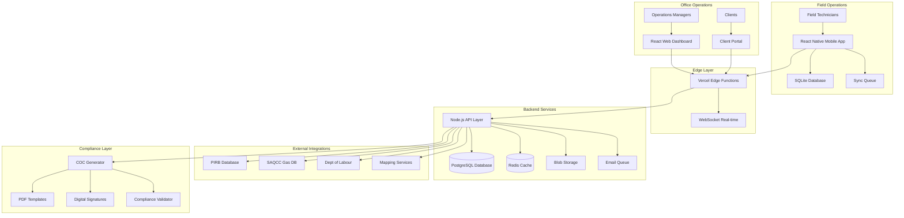
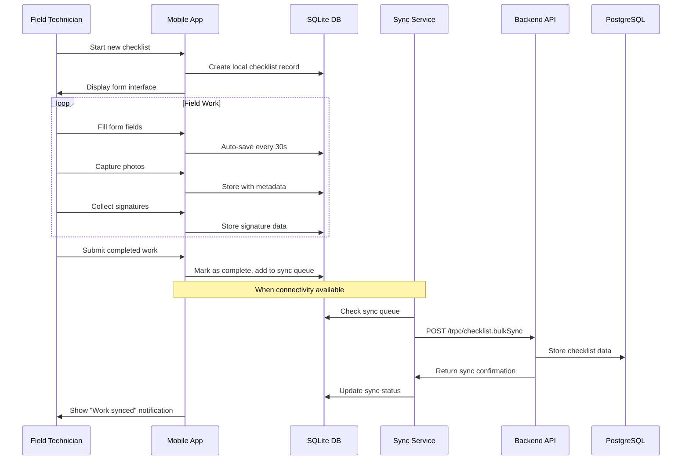
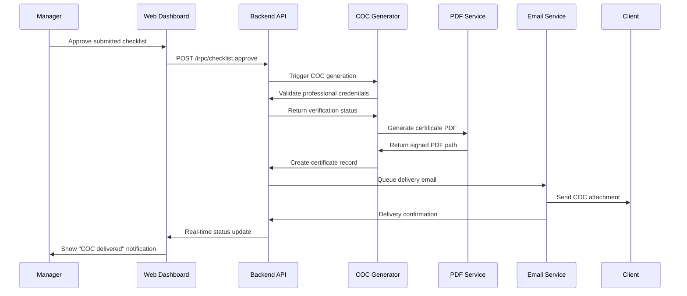
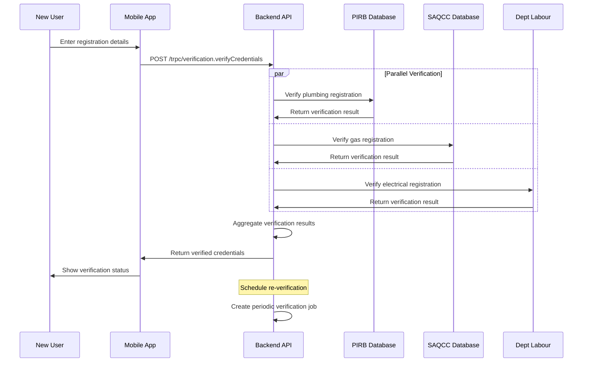
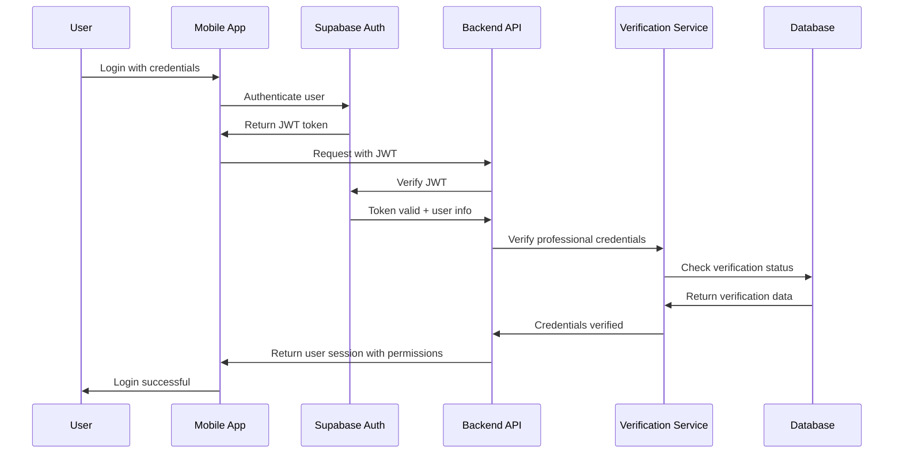
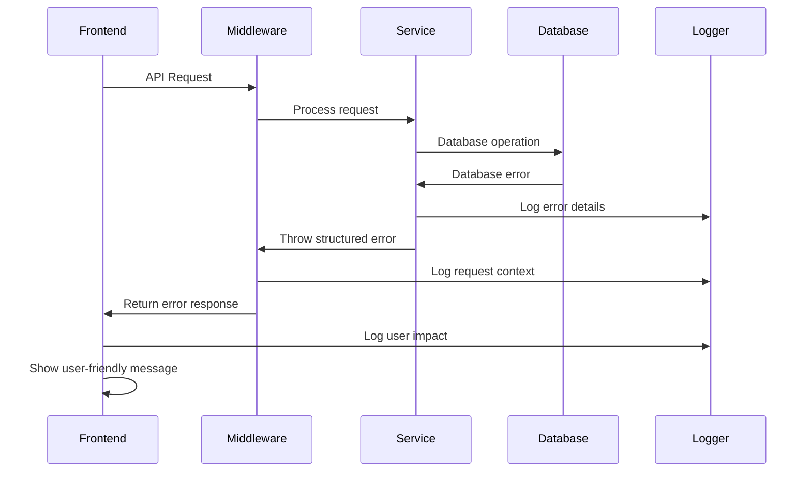

# Tracilo Fullstack Architecture Document

*Version 1.0 - Complete System Architecture*
*Generated: September 18, 2025*

## Introduction

This document outlines the complete fullstack architecture for **Tracilo**, including backend systems, frontend implementation, and their integration. It serves as the single source of truth for AI-driven development, ensuring consistency across the entire technology stack.

This unified approach combines what would traditionally be separate backend and frontend architecture documents, streamlining the development process for modern fullstack applications where these concerns are increasingly intertwined.

### Starter Template or Existing Project

**N/A - Greenfield Project**

This project is starting from scratch with no existing codebase or starter template. Based on the technical requirements and complexity outlined in the PRD, a custom stack approach is recommended using React Native + Node.js + PostgreSQL for maximum flexibility and compliance control.

**Architectural Constraints from This Decision:**
- Monorepo structure with shared TypeScript types
- Custom offline-first sync engine implementation
- Professional verification API integrations with South African regulatory bodies
- Custom COC generation for exact SANS format compliance

### Change Log

| Date | Version | Description | Author |
|------|---------|-------------|--------|
| 2025-09-18 | 1.0 | Initial architecture document | Winston (Architect) |

## High Level Architecture

### Technical Summary

Tracilo employs a **mobile-first fullstack architecture** built around offline-first React Native mobile apps with real-time web dashboard oversight. The system prioritizes field technician workflows through complete offline operation using SQLite local persistence, while providing operations managers with live monitoring via WebSocket-connected React dashboards.

Core integration occurs through a Node.js/Express API layer that handles professional verification with South African regulatory bodies (PIRB, SAQCC Gas, Department of Labour), automated SANS-compliant COC generation, and robust background synchronization with conflict resolution. The architecture deploys on Vercel with PostgreSQL, designed for seamless migration to AWS multi-region infrastructure as the customer base scales across South Africa's trade compliance market.

This architecture directly achieves PRD goals by ensuring 100% offline field operation, legally compliant certificate generation, and real-time operational visibility for managers.

### Platform and Infrastructure Choice

**Platform:** Vercel + Supabase
**Key Services:** Vercel Edge Functions, Supabase PostgreSQL + Auth + Storage + Realtime, Vercel Blob Storage
**Deployment Host and Regions:** Primary: Vercel Global Edge Network, Database: AWS eu-west-1 (closest to South Africa)

### Repository Structure

**Structure:** Monorepo with shared packages architecture
**Monorepo Tool:** Turborepo (integrates perfectly with Vercel deployment)
**Package Organization:** Domain-driven packages with shared types, UI components, and business logic

### High Level Architecture Diagram



### Architectural Patterns

- **Mobile-First Architecture:** React Native drives API design and data patterns, ensuring optimal field technician experience - _Rationale:_ Field technicians are primary users requiring robust offline operation
- **Offline-First Pattern:** Complete SQLite-based operation with eventual consistency sync, guaranteeing work continuity in remote locations - _Rationale:_ South African field locations often have unreliable connectivity
- **Event-Driven Sync:** Background job processing with event sourcing for reliable data synchronization and audit trails - _Rationale:_ Compliance requires complete audit trails and data integrity
- **Multi-Tenant SaaS:** Row-level security with organization isolation, enabling secure separation between companies - _Rationale:_ Multiple trade companies need secure data separation
- **BFF Pattern (Backend for Frontend):** Specialized API endpoints optimized for mobile vs. web dashboard needs - _Rationale:_ Different UX requirements between field and office operations
- **Repository Pattern:** Clean separation of data access logic for testing and future database migration flexibility - _Rationale:_ Enables comprehensive testing of compliance logic
- **Command Query Separation:** Separate read/write operations for optimal sync performance and conflict resolution - _Rationale:_ Offline-first requires sophisticated conflict resolution
- **Compliance-First Design:** All data flows designed around audit trail requirements and regulatory compliance validation - _Rationale:_ Legal validity of COCs cannot be compromised

## Tech Stack

### Technology Stack Table

| Category | Technology | Version | Purpose | Rationale |
|----------|------------|---------|---------|-----------|
| Frontend Language | TypeScript | 5.2+ | Type-safe mobile and web development | Essential for shared types between mobile/web, reduces bugs in compliance-critical code |
| Frontend Framework | React Native | 0.74+ | Cross-platform mobile app with offline-first | New Architecture (Fabric/TurboModules) provides performance needed for field conditions |
| UI Component Library | React Native Elements | 4.0+ | Consistent mobile UI components | Field-tested components optimized for touch interfaces and outdoor visibility |
| State Management | Zustand | 4.4+ | Lightweight state management | Simpler than Redux, perfect for offline-first patterns and mobile performance |
| Backend Language | TypeScript | 5.2+ | Type-safe server development | Consistency with frontend, shared types for API contracts |
| Backend Framework | Express.js | 4.18+ | RESTful API server | Proven stability, extensive ecosystem for professional verification integrations |
| API Style | REST + tRPC | REST/tRPC 10+ | Hybrid API approach | REST for external integrations, tRPC for type-safe internal mobile/web communication |
| Database | PostgreSQL | 15+ | Primary data storage | ACID compliance for financial/legal records, excellent JSON support for form data |
| Cache | Redis | 7.0+ | Session storage and caching | Required for real-time WebSocket connections and professional verification caching |
| File Storage | Vercel Blob | Latest | Photo and PDF storage | Seamless Vercel integration, CDN distribution for certificate delivery |
| Authentication | Supabase Auth | Latest | User authentication and authorization | Built-in professional verification workflows, row-level security for multi-tenant |
| Frontend Testing | Jest + RTL | Jest 29+/RTL 13+ | Unit and integration testing | Standard React testing, critical for compliance validation logic |
| Backend Testing | Jest + Supertest | Jest 29+/Supertest 6+ | API and integration testing | Industry standard, essential for professional verification API testing |
| E2E Testing | Detox | 20+ | Mobile end-to-end testing | React Native specific, tests offline scenarios and sync workflows |
| Build Tool | Turborepo | 1.10+ | Monorepo build orchestration | Optimized for Vercel deployment, caches for fast CI/CD |
| Bundler | Metro (RN) / Webpack (Web) | Latest | JavaScript bundling | React Native standard bundler, Webpack for web dashboard |
| IaC Tool | Terraform | 1.5+ | Infrastructure as code | AWS migration path preparation, repeatable deployments |
| CI/CD | GitHub Actions | Latest | Continuous integration and deployment | Native Vercel integration, automated testing and compliance validation |
| Monitoring | Sentry | Latest | Error tracking and performance | Critical for field app stability, compliance audit trail logging |
| Logging | Winston + Supabase Logs | Latest | Application logging | Structured logging for compliance audits and troubleshooting |
| CSS Framework | NativeWind | 4.0+ | Utility-first styling | Tailwind CSS for React Native, consistent styling across mobile/web |

## Data Models

### Organization

**Purpose:** Multi-tenant organization management for trade companies

**Key Attributes:**
- id: string (UUID) - Unique organization identifier
- name: string - Company name for branding and certificates
- subscriptionTier: enum - Feature access level (basic, professional, enterprise)
- settings: object - Organization-specific configuration (COC templates, branding)
- createdAt: Date - Organization registration timestamp
- complianceSettings: object - Trade-specific compliance requirements

#### TypeScript Interface

```typescript
interface Organization {
  id: string;
  name: string;
  subscriptionTier: 'basic' | 'professional' | 'enterprise';
  settings: OrganizationSettings;
  complianceSettings: ComplianceSettings;
  createdAt: Date;
  updatedAt: Date;
}

interface OrganizationSettings {
  branding: {
    logo?: string;
    primaryColor: string;
    secondaryColor: string;
  };
  cocTemplates: {
    electrical: boolean;
    solar: boolean;
    plumbing: boolean;
    gas: boolean;
    hvac: boolean;
  };
  workflow: {
    requireManagerApproval: boolean;
    autoGenerateCOC: boolean;
    clientNotifications: boolean;
  };
}
```

#### Relationships

- One-to-many with Users (organization members)
- One-to-many with Sites (organization's project sites)
- One-to-many with Templates (organization's custom templates)

### User

**Purpose:** Professional technicians and managers with verified credentials

**Key Attributes:**
- id: string (UUID) - Unique user identifier
- organizationId: string - Organization membership
- email: string - Login and communication
- role: enum - Access control (technician, supervisor, manager, admin)
- professionalCredentials: array - Verified trade qualifications
- registrationNumbers: object - Official registration numbers per trade
- verificationStatus: enum - Current credential validation status

#### TypeScript Interface

```typescript
interface User {
  id: string;
  organizationId: string;
  email: string;
  firstName: string;
  lastName: string;
  role: UserRole;
  professionalCredentials: ProfessionalCredential[];
  registrationNumbers: RegistrationNumbers;
  verificationStatus: 'pending' | 'verified' | 'expired' | 'suspended';
  lastVerified: Date;
  createdAt: Date;
}

interface ProfessionalCredential {
  tradeType: 'electrical' | 'solar' | 'plumbing' | 'gas' | 'hvac';
  registrationNumber: string;
  issuingBody: 'PIRB' | 'SAQCC_GAS' | 'DOL' | 'ECSA';
  expiryDate: Date;
  verificationDate: Date;
  status: 'active' | 'expired' | 'suspended';
}
```

#### Relationships

- Many-to-one with Organization
- One-to-many with Checklists (work performed)
- One-to-many with Certificates (COCs issued)

### Site

**Purpose:** Physical locations where work is performed, central to compliance tracking

**Key Attributes:**
- id: string (UUID) - Unique site identifier
- organizationId: string - Owning organization
- name: string - Site identification name
- address: object - Physical address with GPS coordinates
- clientInfo: object - Property owner contact information
- siteType: enum - Property classification for compliance requirements
- workHistory: array - Complete audit trail of all work performed

#### TypeScript Interface

```typescript
interface Site {
  id: string;
  organizationId: string;
  name: string;
  address: Address;
  clientInfo: ClientInfo;
  siteType: 'residential' | 'commercial' | 'industrial';
  erfNumber?: string;
  municipalityCode: string;
  workHistory: WorkHistoryEntry[];
  createdAt: Date;
  updatedAt: Date;
}

interface Address {
  street: string;
  suburb: string;
  city: string;
  province: string;
  postalCode: string;
  coordinates: {
    latitude: number;
    longitude: number;
    accuracy: number;
  };
}

interface ClientInfo {
  name: string;
  email: string;
  phone: string;
  idNumber?: string;
  company?: string;
}
```

#### Relationships

- Many-to-one with Organization
- One-to-many with Checklists (work performed at site)
- One-to-many with Photos (site documentation)

### ChecklistTemplate

**Purpose:** SANS-compliant inspection and installation workflows

**Key Attributes:**
- id: string (UUID) - Template identifier
- organizationId: string - Custom template ownership
- name: string - Template description
- tradeType: enum - Applicable trade specialization
- version: string - SANS standard version compliance
- schema: object - Dynamic form structure with conditional logic
- cocMapping: object - Field mapping for certificate generation

#### TypeScript Interface

```typescript
interface ChecklistTemplate {
  id: string;
  organizationId?: string; // null for system templates
  name: string;
  tradeType: 'electrical' | 'solar' | 'plumbing' | 'gas' | 'hvac';
  version: string;
  sansStandard: string; // e.g., "SANS 10142-1:2024"
  schema: FormSchema;
  cocMapping: COCFieldMapping;
  isActive: boolean;
  createdAt: Date;
  updatedAt: Date;
}

interface FormSchema {
  sections: FormSection[];
  validationRules: ValidationRule[];
  conditionalLogic: ConditionalRule[];
}

interface FormSection {
  id: string;
  title: string;
  required: boolean;
  fields: FormField[];
  photoPrompts?: PhotoPrompt[];
}
```

#### Relationships

- Many-to-one with Organization (custom templates)
- One-to-many with Checklists (template instances)

### Checklist

**Purpose:** Completed work documentation with compliance validation

**Key Attributes:**
- id: string (UUID) - Work instance identifier
- siteId: string - Location where work performed
- templateId: string - Template used for work
- technicianId: string - Professional who performed work
- status: enum - Current workflow status
- formData: object - All completed form responses
- photos: array - Associated documentation photos
- signatures: array - Digital signatures collected

#### TypeScript Interface

```typescript
interface Checklist {
  id: string;
  siteId: string;
  templateId: string;
  technicianId: string;
  supervisorId?: string;
  status: ChecklistStatus;
  formData: Record<string, any>;
  photos: Photo[];
  signatures: DigitalSignature[];
  startedAt: Date;
  completedAt?: Date;
  approvedAt?: Date;
  syncStatus: 'pending' | 'synced' | 'conflict';
  lastModified: Date;
}

type ChecklistStatus =
  | 'draft'
  | 'in_progress'
  | 'completed'
  | 'submitted'
  | 'approved'
  | 'rejected';

interface Photo {
  id: string;
  checklistId: string;
  fieldId: string;
  localPath: string;
  remotePath?: string;
  metadata: PhotoMetadata;
  uploadStatus: 'pending' | 'uploading' | 'uploaded' | 'failed';
}
```

#### Relationships

- Many-to-one with Site
- Many-to-one with ChecklistTemplate
- Many-to-one with User (technician)
- One-to-one with Certificate (generated COC)

### Certificate

**Purpose:** Generated Certificates of Compliance for regulatory submission

**Key Attributes:**
- id: string (UUID) - Certificate identifier
- checklistId: string - Source work documentation
- certificateNumber: string - Unique sequential number
- professionalId: string - Issuing professional
- certificateType: enum - Type of compliance certificate
- pdfPath: string - Generated certificate file location
- deliveryStatus: enum - Client delivery tracking

#### TypeScript Interface

```typescript
interface Certificate {
  id: string;
  checklistId: string;
  certificateNumber: string;
  professionalId: string;
  certificateType: 'electrical' | 'solar' | 'plumbing' | 'gas' | 'hvac';
  pdfPath: string;
  generatedAt: Date;
  deliveredAt?: Date;
  deliveryStatus: 'pending' | 'delivered' | 'failed' | 'bounced';
  validationHash: string;
  recipients: string[];
  sansCompliance: {
    standard: string;
    version: string;
    validatedAt: Date;
  };
}
```

#### Relationships

- One-to-one with Checklist
- Many-to-one with User (issuing professional)

## API Specification

### tRPC Router Definitions

```typescript
import { z } from 'zod';
import { router, procedure } from './trpc';

// Checklist management router
export const checklistRouter = router({
  // Get checklist by ID with offline sync support
  getById: procedure
    .input(z.object({ id: z.string(), lastSyncTimestamp: z.date().optional() }))
    .query(async ({ input, ctx }) => {
      // Returns checklist with sync metadata
    }),

  // Create new checklist from template
  create: procedure
    .input(z.object({
      siteId: z.string(),
      templateId: z.string(),
      initialData: z.record(z.any()).optional()
    }))
    .mutation(async ({ input, ctx }) => {
      // Creates checklist and returns with sync token
    }),

  // Update checklist with conflict resolution
  update: procedure
    .input(z.object({
      id: z.string(),
      formData: z.record(z.any()),
      lastModified: z.date(),
      clientVersion: z.number()
    }))
    .mutation(async ({ input, ctx }) => {
      // Handles optimistic updates and conflicts
    }),

  // Submit completed checklist for approval
  submit: procedure
    .input(z.object({
      id: z.string(),
      signatures: z.array(signatureSchema),
      photos: z.array(photoSchema)
    }))
    .mutation(async ({ input, ctx }) => {
      // Validates completeness and triggers COC generation
    }),

  // Bulk sync for offline operations
  bulkSync: procedure
    .input(z.object({
      operations: z.array(syncOperationSchema),
      lastSyncTimestamp: z.date()
    }))
    .mutation(async ({ input, ctx }) => {
      // Processes multiple operations atomically
    })
});

// Certificate generation router
export const certificateRouter = router({
  // Generate COC from completed checklist
  generate: procedure
    .input(z.object({
      checklistId: z.string(),
      certificateType: z.enum(['electrical', 'solar', 'plumbing', 'gas', 'hvac']),
      deliverTo: z.array(z.string().email())
    }))
    .mutation(async ({ input, ctx }) => {
      // Validates compliance and generates PDF
    }),

  // Get certificate status and download link
  getStatus: procedure
    .input(z.object({ certificateId: z.string() }))
    .query(async ({ input, ctx }) => {
      // Returns generation status and delivery tracking
    }),

  // Resend certificate to additional recipients
  resend: procedure
    .input(z.object({
      certificateId: z.string(),
      recipients: z.array(z.string().email())
    }))
    .mutation(async ({ input, ctx }) => {
      // Queues delivery to new recipients
    })
});

// Professional verification router
export const verificationRouter = router({
  // Verify professional credentials
  verifyCredentials: procedure
    .input(z.object({
      tradeType: z.enum(['electrical', 'solar', 'plumbing', 'gas', 'hvac']),
      registrationNumber: z.string(),
      issuingBody: z.enum(['PIRB', 'SAQCC_GAS', 'DOL', 'ECSA'])
    }))
    .mutation(async ({ input, ctx }) => {
      // Integrates with regulatory body APIs
    }),

  // Get verification status
  getStatus: procedure
    .input(z.object({ userId: z.string() }))
    .query(async ({ input, ctx }) => {
      // Returns current verification status and expiry
    }),

  // Schedule re-verification
  scheduleReverification: procedure
    .input(z.object({ userId: z.string() }))
    .mutation(async ({ input, ctx }) => {
      // Queues periodic credential validation
    })
});

// Real-time subscription router
export const subscriptionRouter = router({
  // Subscribe to checklist updates
  checklistUpdates: procedure
    .input(z.object({ organizationId: z.string() }))
    .subscription(({ input, ctx }) => {
      // WebSocket subscription for real-time updates
    }),

  // Subscribe to team activity
  teamActivity: procedure
    .input(z.object({ organizationId: z.string() }))
    .subscription(({ input, ctx }) => {
      // Live dashboard updates for managers
    })
});

// Main app router
export const appRouter = router({
  checklist: checklistRouter,
  certificate: certificateRouter,
  verification: verificationRouter,
  subscription: subscriptionRouter
});

export type AppRouter = typeof appRouter;
```

## Components

### MobileFormEngine

**Responsibility:** Dynamic form rendering with offline-first validation

**Key Interfaces:**
- FormSchema processing and dynamic field generation
- Conditional logic execution and field visibility
- Auto-save functionality every 30 seconds

**Dependencies:** SQLite storage, photo capture service, signature collection

**Technology Stack:** React Native with Zustand state management, SQLite persistence, form validation

### SyncManager

**Responsibility:** Background synchronization with conflict resolution

**Key Interfaces:**
- Queue management for offline operations
- Retry logic with exponential backoff
- WebSocket connections for real-time updates

**Dependencies:** Network detection, local database, backend API

**Technology Stack:** Background tasks, optimistic updates, tRPC client

### ComplianceValidator

**Responsibility:** SANS standard validation and COC generation

**Key Interfaces:**
- Template validation against SANS standards
- Professional verification integration
- PDF generation and digital signature embedding

**Dependencies:** Professional credentials, regulatory APIs, PDF service

**Technology Stack:** Validation schemas, PDF libraries, API integrations

### ProfessionalVerificationService

**Responsibility:** Real-time credential validation with regulatory bodies

**Key Interfaces:**
- PIRB/SAQCC/DOL API integrations
- Credential caching and renewal monitoring
- Manual verification fallback workflows

**Dependencies:** External APIs, Redis cache, notification service

**Technology Stack:** Express middleware, API clients, scheduled jobs

### COCGenerationEngine

**Responsibility:** Automated certificate generation and delivery

**Key Interfaces:**
- PDF template processing and data population
- Digital signature embedding and validation
- Email delivery and tracking

**Dependencies:** Checklist validation, professional verification, file storage

**Technology Stack:** PDF generation, template engine, email service

## External APIs

### PIRB (Plumbing Industry Registration Board)

- **Purpose:** Plumbing professional verification
- **Documentation:** https://pirb.co.za/api (hypothetical - request actual URL)
- **Base URL(s):** https://api.pirb.co.za/v1
- **Authentication:** API key + certificate-based
- **Rate Limits:** 100 requests/minute

**Key Endpoints Used:**
- `POST /verify-professional` - Validate registration number and credentials

**Integration Notes:** Fallback to manual verification if API unavailable, cache results for 24 hours

### SAQCC Gas

- **Purpose:** Gas installation professional verification
- **Documentation:** Request from SAQCC Gas
- **Base URL(s):** To be provided
- **Authentication:** To be determined
- **Rate Limits:** Unknown - implement conservative limits

**Key Endpoints Used:**
- Professional lookup and category validation

**Integration Notes:** Critical for gas COC generation compliance, manual verification required until API available

## Core Workflows

### Offline Checklist Completion Flow



### COC Generation and Delivery Flow



### Professional Verification Flow



## Database Schema

```sql
-- Organizations table with row-level security
CREATE TABLE organizations (
    id UUID PRIMARY KEY DEFAULT gen_random_uuid(),
    name VARCHAR(255) NOT NULL,
    subscription_tier subscription_tier_enum NOT NULL DEFAULT 'basic',
    settings JSONB NOT NULL DEFAULT '{}',
    compliance_settings JSONB NOT NULL DEFAULT '{}',
    created_at TIMESTAMP WITH TIME ZONE DEFAULT NOW(),
    updated_at TIMESTAMP WITH TIME ZONE DEFAULT NOW()
);

-- Users with professional verification
CREATE TABLE users (
    id UUID PRIMARY KEY DEFAULT gen_random_uuid(),
    organization_id UUID NOT NULL REFERENCES organizations(id) ON DELETE CASCADE,
    email VARCHAR(255) UNIQUE NOT NULL,
    first_name VARCHAR(100) NOT NULL,
    last_name VARCHAR(100) NOT NULL,
    role user_role_enum NOT NULL DEFAULT 'technician',
    professional_credentials JSONB NOT NULL DEFAULT '[]',
    registration_numbers JSONB NOT NULL DEFAULT '{}',
    verification_status verification_status_enum NOT NULL DEFAULT 'pending',
    last_verified TIMESTAMP WITH TIME ZONE,
    created_at TIMESTAMP WITH TIME ZONE DEFAULT NOW(),
    updated_at TIMESTAMP WITH TIME ZONE DEFAULT NOW()
);

-- Sites with GPS coordinates
CREATE TABLE sites (
    id UUID PRIMARY KEY DEFAULT gen_random_uuid(),
    organization_id UUID NOT NULL REFERENCES organizations(id) ON DELETE CASCADE,
    name VARCHAR(255) NOT NULL,
    address JSONB NOT NULL,
    client_info JSONB NOT NULL,
    site_type site_type_enum NOT NULL DEFAULT 'residential',
    erf_number VARCHAR(50),
    municipality_code VARCHAR(20),
    work_history JSONB NOT NULL DEFAULT '[]',
    created_at TIMESTAMP WITH TIME ZONE DEFAULT NOW(),
    updated_at TIMESTAMP WITH TIME ZONE DEFAULT NOW()
);

-- SANS-compliant checklist templates
CREATE TABLE checklist_templates (
    id UUID PRIMARY KEY DEFAULT gen_random_uuid(),
    organization_id UUID REFERENCES organizations(id) ON DELETE CASCADE, -- NULL for system templates
    name VARCHAR(255) NOT NULL,
    trade_type trade_type_enum NOT NULL,
    version VARCHAR(50) NOT NULL,
    sans_standard VARCHAR(100) NOT NULL,
    schema JSONB NOT NULL,
    coc_mapping JSONB NOT NULL,
    is_active BOOLEAN NOT NULL DEFAULT true,
    created_at TIMESTAMP WITH TIME ZONE DEFAULT NOW(),
    updated_at TIMESTAMP WITH TIME ZONE DEFAULT NOW()
);

-- Completed work checklists
CREATE TABLE checklists (
    id UUID PRIMARY KEY DEFAULT gen_random_uuid(),
    site_id UUID NOT NULL REFERENCES sites(id) ON DELETE CASCADE,
    template_id UUID NOT NULL REFERENCES checklist_templates(id),
    technician_id UUID NOT NULL REFERENCES users(id),
    supervisor_id UUID REFERENCES users(id),
    status checklist_status_enum NOT NULL DEFAULT 'draft',
    form_data JSONB NOT NULL DEFAULT '{}',
    started_at TIMESTAMP WITH TIME ZONE DEFAULT NOW(),
    completed_at TIMESTAMP WITH TIME ZONE,
    approved_at TIMESTAMP WITH TIME ZONE,
    sync_status sync_status_enum NOT NULL DEFAULT 'pending',
    client_version INTEGER NOT NULL DEFAULT 1,
    last_modified TIMESTAMP WITH TIME ZONE DEFAULT NOW()
);

-- Photo documentation
CREATE TABLE photos (
    id UUID PRIMARY KEY DEFAULT gen_random_uuid(),
    checklist_id UUID NOT NULL REFERENCES checklists(id) ON DELETE CASCADE,
    field_id VARCHAR(100) NOT NULL,
    local_path VARCHAR(500),
    remote_path VARCHAR(500),
    metadata JSONB NOT NULL DEFAULT '{}',
    upload_status upload_status_enum NOT NULL DEFAULT 'pending',
    created_at TIMESTAMP WITH TIME ZONE DEFAULT NOW()
);

-- Digital signatures
CREATE TABLE signatures (
    id UUID PRIMARY KEY DEFAULT gen_random_uuid(),
    checklist_id UUID NOT NULL REFERENCES checklists(id) ON DELETE CASCADE,
    signatory_info JSONB NOT NULL,
    signature_data TEXT NOT NULL, -- SVG vector data
    timestamp TIMESTAMP WITH TIME ZONE NOT NULL,
    gps_coordinates JSONB,
    device_info JSONB NOT NULL,
    compliance_hash VARCHAR(256) NOT NULL,
    created_at TIMESTAMP WITH TIME ZONE DEFAULT NOW()
);

-- Generated certificates
CREATE TABLE certificates (
    id UUID PRIMARY KEY DEFAULT gen_random_uuid(),
    checklist_id UUID NOT NULL REFERENCES checklists(id) ON DELETE CASCADE,
    certificate_number VARCHAR(50) UNIQUE NOT NULL,
    professional_id UUID NOT NULL REFERENCES users(id),
    certificate_type trade_type_enum NOT NULL,
    pdf_path VARCHAR(500) NOT NULL,
    generated_at TIMESTAMP WITH TIME ZONE DEFAULT NOW(),
    delivered_at TIMESTAMP WITH TIME ZONE,
    delivery_status delivery_status_enum NOT NULL DEFAULT 'pending',
    validation_hash VARCHAR(256) NOT NULL,
    recipients JSONB NOT NULL DEFAULT '[]',
    sans_compliance JSONB NOT NULL
);

-- Sync queue for offline operations
CREATE TABLE sync_queue (
    id UUID PRIMARY KEY DEFAULT gen_random_uuid(),
    user_id UUID NOT NULL REFERENCES users(id),
    action_type VARCHAR(50) NOT NULL,
    entity_type VARCHAR(50) NOT NULL,
    entity_id UUID NOT NULL,
    operation_data JSONB NOT NULL,
    status sync_queue_status_enum NOT NULL DEFAULT 'pending',
    retries INTEGER NOT NULL DEFAULT 0,
    error_message TEXT,
    created_at TIMESTAMP WITH TIME ZONE DEFAULT NOW(),
    processed_at TIMESTAMP WITH TIME ZONE
);

-- Indexes for performance
CREATE INDEX idx_users_organization ON users(organization_id);
CREATE INDEX idx_sites_organization ON sites(organization_id);
CREATE INDEX idx_checklists_site ON checklists(site_id);
CREATE INDEX idx_checklists_technician ON checklists(technician_id);
CREATE INDEX idx_checklists_status ON checklists(status);
CREATE INDEX idx_photos_checklist ON photos(checklist_id);
CREATE INDEX idx_certificates_checklist ON certificates(checklist_id);
CREATE INDEX idx_sync_queue_user_status ON sync_queue(user_id, status);

-- Row Level Security policies
ALTER TABLE organizations ENABLE ROW LEVEL SECURITY;
ALTER TABLE users ENABLE ROW LEVEL SECURITY;
ALTER TABLE sites ENABLE ROW LEVEL SECURITY;
ALTER TABLE checklists ENABLE ROW LEVEL SECURITY;

-- Organization isolation policy
CREATE POLICY org_isolation_policy ON users
    FOR ALL USING (organization_id = current_setting('app.current_organization_id')::UUID);
```

## Frontend Architecture

### Component Architecture

#### Component Organization

```
src/
├── components/
│   ├── forms/
│   │   ├── DynamicForm.tsx
│   │   ├── FormField.tsx
│   │   └── SignatureCapture.tsx
│   ├── layout/
│   │   ├── AppLayout.tsx
│   │   └── Navigation.tsx
│   ├── common/
│   │   ├── Button.tsx
│   │   ├── Input.tsx
│   │   └── PhotoPicker.tsx
│   └── checklist/
│       ├── ChecklistForm.tsx
│       ├── PhotoGrid.tsx
│       └── ProgressIndicator.tsx
├── screens/
│   ├── ChecklistScreen.tsx
│   ├── SiteListScreen.tsx
│   └── ProfileScreen.tsx
├── hooks/
│   ├── useOfflineSync.ts
│   ├── usePhotoCapture.ts
│   └── useFormValidation.ts
└── stores/
    ├── checklistStore.ts
    ├── syncStore.ts
    └── authStore.ts
```

#### Component Template

```typescript
import React from 'react';
import { View, Text } from 'react-native';
import { useChecklistStore } from '../stores/checklistStore';

interface ChecklistFormProps {
  templateId: string;
  siteId: string;
  onComplete: (data: ChecklistData) => void;
}

export const ChecklistForm: React.FC<ChecklistFormProps> = ({
  templateId,
  siteId,
  onComplete
}) => {
  const { createChecklist, updateChecklist } = useChecklistStore();

  // Component implementation with offline-first patterns
  return (
    <View>
      {/* Dynamic form rendering */}
    </View>
  );
};
```

### State Management Architecture

#### State Structure

```typescript
interface AppState {
  auth: {
    user: User | null;
    isAuthenticated: boolean;
    credentials: ProfessionalCredential[];
  };
  checklists: {
    active: Checklist[];
    completed: Checklist[];
    templates: ChecklistTemplate[];
  };
  sync: {
    queue: SyncOperation[];
    status: 'idle' | 'syncing' | 'error';
    lastSync: Date;
  };
  offline: {
    isOnline: boolean;
    pendingOperations: number;
    conflicts: SyncConflict[];
  };
}
```

#### State Management Patterns

- Zustand stores for lightweight state management
- Offline-first patterns with optimistic updates
- Automatic persistence to SQLite storage
- Conflict resolution for concurrent edits

### Routing Architecture

#### Route Organization

```
app/
├── (auth)/
│   ├── login.tsx
│   └── register.tsx
├── (main)/
│   ├── dashboard.tsx
│   ├── sites/
│   │   ├── index.tsx
│   │   └── [id].tsx
│   ├── checklists/
│   │   ├── index.tsx
│   │   ├── [id].tsx
│   │   └── new.tsx
│   └── profile/
│       └── index.tsx
└── _layout.tsx
```

#### Protected Route Pattern

```typescript
import React from 'react';
import { useAuth } from '../hooks/useAuth';
import { LoginScreen } from '../screens/LoginScreen';

interface ProtectedRouteProps {
  children: React.ReactNode;
  requiredRole?: UserRole[];
}

export const ProtectedRoute: React.FC<ProtectedRouteProps> = ({
  children,
  requiredRole
}) => {
  const { user, isAuthenticated } = useAuth();

  if (!isAuthenticated) {
    return <LoginScreen />;
  }

  if (requiredRole && !requiredRole.includes(user.role)) {
    return <UnauthorizedScreen />;
  }

  return <>{children}</>;
};
```

### Frontend Services Layer

#### API Client Setup

```typescript
import { createTRPCReact } from '@trpc/react-query';
import type { AppRouter } from '@tracilo/api';

export const trpc = createTRPCReact<AppRouter>();

export const TRPCProvider: React.FC<{ children: React.ReactNode }> = ({
  children
}) => {
  const [queryClient] = useState(() => new QueryClient({
    defaultOptions: {
      queries: {
        staleTime: 5 * 60 * 1000, // 5 minutes
        cacheTime: 10 * 60 * 1000, // 10 minutes
      },
    },
  }));

  const [trpcClient] = useState(() =>
    trpc.createClient({
      links: [
        httpBatchLink({
          url: process.env.EXPO_PUBLIC_API_URL + '/trpc',
        }),
      ],
    })
  );

  return (
    <trpc.Provider client={trpcClient} queryClient={queryClient}>
      <QueryClientProvider client={queryClient}>
        {children}
      </QueryClientProvider>
    </trpc.Provider>
  );
};
```

#### Service Example

```typescript
import { trpc } from '../utils/trpc';
import { useOfflineStorage } from '../hooks/useOfflineStorage';

export const useChecklistService = () => {
  const { store, retrieve } = useOfflineStorage();

  const createChecklistMutation = trpc.checklist.create.useMutation({
    onSuccess: (data) => {
      // Store locally for offline access
      store('checklist', data.id, data);
    },
    onError: (error) => {
      // Handle offline scenario
      console.error('Failed to create checklist:', error);
    },
  });

  const createChecklist = async (input: CreateChecklistInput) => {
    try {
      return await createChecklistMutation.mutateAsync(input);
    } catch (error) {
      // Fallback to offline storage
      const offlineChecklist = await createOfflineChecklist(input);
      return offlineChecklist;
    }
  };

  return {
    createChecklist,
    // Other service methods
  };
};
```

## Backend Architecture

### Service Architecture

#### Traditional Server Architecture

##### Controller/Route Organization

```
src/
├── routers/
│   ├── checklist.ts
│   ├── certificate.ts
│   ├── verification.ts
│   └── subscription.ts
├── services/
│   ├── ChecklistService.ts
│   ├── COCGenerationService.ts
│   ├── VerificationService.ts
│   └── SyncService.ts
├── middleware/
│   ├── auth.ts
│   ├── validation.ts
│   └── rateLimit.ts
├── models/
│   ├── Checklist.ts
│   ├── Certificate.ts
│   └── User.ts
└── integrations/
    ├── PIRBClient.ts
    ├── SAQCCClient.ts
    └── DOLClient.ts
```

##### Controller Template

```typescript
import { router, procedure } from '../trpc';
import { ChecklistService } from '../services/ChecklistService';
import { z } from 'zod';

const checklistService = new ChecklistService();

export const checklistRouter = router({
  create: procedure
    .input(z.object({
      siteId: z.string(),
      templateId: z.string(),
      initialData: z.record(z.any()).optional()
    }))
    .mutation(async ({ input, ctx }) => {
      const checklist = await checklistService.createChecklist({
        ...input,
        technicianId: ctx.user.id,
        organizationId: ctx.user.organizationId
      });

      return checklist;
    }),

  update: procedure
    .input(z.object({
      id: z.string(),
      formData: z.record(z.any()),
      lastModified: z.date(),
      clientVersion: z.number()
    }))
    .mutation(async ({ input, ctx }) => {
      const result = await checklistService.updateWithConflictResolution(
        input.id,
        input.formData,
        input.clientVersion,
        ctx.user.id
      );

      return result;
    })
});
```

### Database Architecture

#### Schema Design

```sql
-- Core schema with proper indexing and constraints
CREATE TABLE checklists (
    id UUID PRIMARY KEY DEFAULT gen_random_uuid(),
    site_id UUID NOT NULL REFERENCES sites(id) ON DELETE CASCADE,
    template_id UUID NOT NULL REFERENCES checklist_templates(id),
    technician_id UUID NOT NULL REFERENCES users(id),
    supervisor_id UUID REFERENCES users(id),
    status checklist_status_enum NOT NULL DEFAULT 'draft',
    form_data JSONB NOT NULL DEFAULT '{}',
    started_at TIMESTAMP WITH TIME ZONE DEFAULT NOW(),
    completed_at TIMESTAMP WITH TIME ZONE,
    approved_at TIMESTAMP WITH TIME ZONE,
    sync_status sync_status_enum NOT NULL DEFAULT 'pending',
    client_version INTEGER NOT NULL DEFAULT 1,
    last_modified TIMESTAMP WITH TIME ZONE DEFAULT NOW(),

    -- Constraints
    CONSTRAINT valid_completion_flow
        CHECK (completed_at IS NULL OR completed_at >= started_at),
    CONSTRAINT valid_approval_flow
        CHECK (approved_at IS NULL OR approved_at >= completed_at)
);

-- Performance indexes
CREATE INDEX idx_checklists_status_org ON checklists(status, technician_id)
    WHERE status IN ('completed', 'submitted');
CREATE INDEX idx_checklists_sync_pending ON checklists(sync_status, last_modified)
    WHERE sync_status = 'pending';
```

#### Data Access Layer

```typescript
import { Prisma, PrismaClient } from '@prisma/client';

export class ChecklistRepository {
  constructor(private prisma: PrismaClient) {}

  async findWithConflictDetection(
    id: string,
    clientVersion: number
  ): Promise<ChecklistWithConflict> {
    const checklist = await this.prisma.checklist.findUnique({
      where: { id },
      include: {
        photos: true,
        signatures: true,
        site: true,
        template: true
      }
    });

    if (!checklist) {
      throw new Error('Checklist not found');
    }

    const hasConflict = checklist.clientVersion > clientVersion;

    return {
      ...checklist,
      hasConflict,
      conflictData: hasConflict ? {
        serverVersion: checklist.clientVersion,
        clientVersion,
        conflictFields: await this.detectConflictFields(id, clientVersion)
      } : null
    };
  }

  async updateWithOptimisticLocking(
    id: string,
    data: Partial<Checklist>,
    expectedVersion: number
  ): Promise<Checklist> {
    const result = await this.prisma.checklist.updateMany({
      where: {
        id,
        clientVersion: expectedVersion
      },
      data: {
        ...data,
        clientVersion: expectedVersion + 1,
        lastModified: new Date()
      }
    });

    if (result.count === 0) {
      throw new ConflictError('Checklist was modified by another user');
    }

    return this.findById(id);
  }
}
```

### Authentication and Authorization

#### Auth Flow



#### Middleware/Guards

```typescript
import { TRPCError } from '@trpc/server';
import { verifyJWT } from '../utils/auth';

export const authMiddleware = async (opts: any) => {
  const { req, next } = opts;

  const token = req.headers.authorization?.replace('Bearer ', '');

  if (!token) {
    throw new TRPCError({
      code: 'UNAUTHORIZED',
      message: 'Authentication required'
    });
  }

  try {
    const user = await verifyJWT(token);

    // Check professional verification status
    if (user.verificationStatus !== 'verified') {
      throw new TRPCError({
        code: 'FORBIDDEN',
        message: 'Professional verification required'
      });
    }

    return next({
      ctx: {
        user,
        organizationId: user.organizationId
      }
    });
  } catch (error) {
    throw new TRPCError({
      code: 'UNAUTHORIZED',
      message: 'Invalid token'
    });
  }
};

export const requireRole = (roles: UserRole[]) => {
  return (opts: any) => {
    const { ctx, next } = opts;

    if (!roles.includes(ctx.user.role)) {
      throw new TRPCError({
        code: 'FORBIDDEN',
        message: 'Insufficient permissions'
      });
    }

    return next();
  };
};
```

## Unified Project Structure

```
tracilo/
├── .github/                    # CI/CD workflows
│   └── workflows/
│       ├── ci.yaml
│       └── deploy.yaml
├── apps/                       # Application packages
│   ├── mobile/                 # React Native application
│   │   ├── src/
│   │   │   ├── components/     # UI components
│   │   │   ├── screens/        # Screen components
│   │   │   ├── hooks/          # Custom React hooks
│   │   │   ├── services/       # API client services
│   │   │   ├── stores/         # Zustand state stores
│   │   │   ├── styles/         # NativeWind styles
│   │   │   └── utils/          # Mobile utilities
│   │   ├── android/            # Android-specific code
│   │   ├── ios/                # iOS-specific code (future)
│   │   └── package.json
│   ├── web/                    # React web dashboard
│   │   ├── src/
│   │   │   ├── components/     # Web UI components
│   │   │   ├── pages/          # Next.js pages
│   │   │   ├── hooks/          # Custom React hooks
│   │   │   ├── services/       # API client services
│   │   │   ├── stores/         # Zustand state stores
│   │   │   └── utils/          # Web utilities
│   │   ├── public/             # Static assets
│   │   └── package.json
│   └── api/                    # Backend application
│       ├── src/
│       │   ├── routers/        # tRPC routers
│       │   ├── services/       # Business logic
│       │   ├── models/         # Database models
│       │   ├── middleware/     # Express middleware
│       │   ├── integrations/   # External API clients
│       │   └── server.ts       # Express server entry
│       └── package.json
├── packages/                   # Shared packages
│   ├── shared/                 # Shared types/utilities
│   │   ├── src/
│   │   │   ├── types/          # TypeScript interfaces
│   │   │   ├── constants/      # Shared constants
│   │   │   ├── schemas/        # Zod validation schemas
│   │   │   └── utils/          # Shared utilities
│   │   └── package.json
│   ├── ui/                     # Shared UI components
│   │   ├── src/
│   │   └── package.json
│   └── config/                 # Shared configuration
│       ├── eslint/
│       ├── typescript/
│       └── jest/
├── infrastructure/             # Terraform IaC
│   ├── environments/
│   │   ├── staging/
│   │   └── production/
│   └── modules/
├── docs/                       # Documentation
│   ├── product-requirements.md
│   ├── architecture.md
│   └── api-spec.md
├── .env.example                # Environment template
├── package.json                # Root package.json
├── turbo.json                  # Turborepo configuration
└── README.md
```

## Development Workflow

### Local Development Setup

#### Prerequisites

```bash
# Install Node.js 18+, pnpm, and React Native CLI
curl -fsSL https://get.pnpm.io/install.sh | sh
npm install -g @react-native-community/cli
```

#### Initial Setup

```bash
# Clone and install dependencies
git clone <repository-url>
cd tracilo
pnpm install

# Setup environment variables
cp .env.example .env.local
# Edit .env.local with your development keys

# Initialize database
pnpm db:migrate
pnpm db:seed
```

#### Development Commands

```bash
# Start all services (mobile, web, api)
pnpm dev

# Start mobile only
pnpm dev:mobile

# Start web dashboard only
pnpm dev:web

# Start backend API only
pnpm dev:api

# Run tests
pnpm test
pnpm test:e2e
```

### Environment Configuration

#### Required Environment Variables

```bash
# Frontend (.env.local)
NEXT_PUBLIC_API_URL=http://localhost:3001
NEXT_PUBLIC_SUPABASE_URL=your_supabase_url
NEXT_PUBLIC_SUPABASE_ANON_KEY=your_supabase_key

# Backend (.env)
DATABASE_URL=postgresql://localhost:5432/tracilo_dev
REDIS_URL=redis://localhost:6379
SUPABASE_SERVICE_KEY=your_service_key
PIRB_API_KEY=your_pirb_key
SAQCC_API_KEY=your_saqcc_key

# Shared
JWT_SECRET=your_jwt_secret
ENCRYPTION_KEY=your_encryption_key
```

## Deployment Architecture

### Deployment Strategy

**Frontend Deployment:**
- **Platform:** Vercel Edge Network
- **Build Command:** `pnpm build:web`
- **Output Directory:** `apps/web/.next`
- **CDN/Edge:** Vercel Edge Functions for global distribution

**Backend Deployment:**
- **Platform:** Vercel Serverless Functions
- **Build Command:** `pnpm build:api`
- **Deployment Method:** Serverless function deployment

**Mobile Deployment:**
- **Platform:** Google Play Store (Android), App Store (iOS future)
- **Build Command:** `pnpm build:mobile`
- **Distribution:** Over-the-air updates via Expo Updates

### CI/CD Pipeline

```yaml
name: Deploy
on:
  push:
    branches: [main]

jobs:
  test:
    runs-on: ubuntu-latest
    steps:
      - uses: actions/checkout@v3
      - uses: pnpm/action-setup@v2
      - run: pnpm install
      - run: pnpm test
      - run: pnpm build

  deploy:
    needs: test
    runs-on: ubuntu-latest
    steps:
      - uses: actions/checkout@v3
      - uses: amondnet/vercel-action@v20
        with:
          vercel-token: ${{ secrets.VERCEL_TOKEN }}
          vercel-org-id: ${{ secrets.ORG_ID }}
          vercel-project-id: ${{ secrets.PROJECT_ID }}
```

### Environments

| Environment | Frontend URL | Backend URL | Purpose |
|-------------|--------------|-------------|---------|
| Development | http://localhost:3000 | http://localhost:3001 | Local development |
| Staging | https://staging.tracilo.app | https://api-staging.tracilo.app | Pre-production testing |
| Production | https://tracilo.app | https://api.tracilo.app | Live environment |

## Security and Performance

### Security Requirements

**Frontend Security:**
- CSP Headers: `default-src 'self'; script-src 'self' 'unsafe-inline'; style-src 'self' 'unsafe-inline'`
- XSS Prevention: Input sanitization, React's built-in protection
- Secure Storage: Encrypted SQLite for sensitive compliance data

**Backend Security:**
- Input Validation: Zod schemas for all API inputs
- Rate Limiting: 100 req/min per user, 1000 req/min per organization
- CORS Policy: Restrict to mobile app and web dashboard domains

**Authentication Security:**
- Token Storage: Secure HTTP-only cookies for web, encrypted storage for mobile
- Session Management: 24-hour access tokens, 30-day refresh tokens
- Password Policy: Minimum 12 characters, complexity requirements

### Performance Optimization

**Frontend Performance:**
- Bundle Size Target: <5MB for mobile app, <1MB for web dashboard
- Loading Strategy: Lazy loading for non-critical components
- Caching Strategy: React Query for API caching, service worker for assets

**Backend Performance:**
- Response Time Target: <200ms for API endpoints
- Database Optimization: Proper indexing, connection pooling
- Caching Strategy: Redis for session data, CDN for static assets

## Testing Strategy

### Testing Pyramid

```
      E2E Tests
     /        \
  Integration Tests
 /            \
Frontend Unit  Backend Unit
```

### Test Organization

#### Frontend Tests

```
apps/mobile/tests/
├── components/
│   ├── ChecklistForm.test.tsx
│   └── PhotoCapture.test.tsx
├── screens/
│   ├── ChecklistScreen.test.tsx
│   └── SiteListScreen.test.tsx
├── hooks/
│   ├── useOfflineSync.test.ts
│   └── useFormValidation.test.ts
└── e2e/
    ├── checklist-flow.e2e.ts
    └── offline-sync.e2e.ts
```

#### Backend Tests

```
apps/api/tests/
├── routers/
│   ├── checklist.test.ts
│   └── certificate.test.ts
├── services/
│   ├── COCGeneration.test.ts
│   └── Verification.test.ts
└── integration/
    ├── checklist-workflow.test.ts
    └── professional-verification.test.ts
```

#### E2E Tests

```
tests/e2e/
├── checklist-completion.spec.ts
├── coc-generation.spec.ts
├── offline-sync.spec.ts
└── professional-verification.spec.ts
```

### Test Examples

#### Frontend Component Test

```typescript
import React from 'react';
import { render, fireEvent, waitFor } from '@testing-library/react-native';
import { ChecklistForm } from '../src/components/ChecklistForm';
import { TestWrapper } from './utils/TestWrapper';

describe('ChecklistForm', () => {
  it('should save form data automatically', async () => {
    const onComplete = jest.fn();
    const { getByTestId } = render(
      <TestWrapper>
        <ChecklistForm
          templateId="template-1"
          siteId="site-1"
          onComplete={onComplete}
        />
      </TestWrapper>
    );

    const textInput = getByTestId('form-field-description');
    fireEvent.changeText(textInput, 'Test description');

    await waitFor(() => {
      expect(mockSQLiteStorage.save).toHaveBeenCalledWith(
        expect.objectContaining({
          formData: expect.objectContaining({
            description: 'Test description'
          })
        })
      );
    }, { timeout: 30000 }); // Auto-save interval
  });
});
```

#### Backend API Test

```typescript
import request from 'supertest';
import { app } from '../src/server';
import { createTestUser, createTestChecklist } from './utils/testHelpers';

describe('POST /trpc/checklist.submit', () => {
  it('should generate COC after checklist submission', async () => {
    const user = await createTestUser({ role: 'technician' });
    const checklist = await createTestChecklist({
      technicianId: user.id,
      status: 'completed'
    });

    const response = await request(app)
      .post('/trpc/checklist.submit')
      .set('Authorization', `Bearer ${user.token}`)
      .send({
        id: checklist.id,
        signatures: [mockSignature],
        photos: [mockPhoto]
      });

    expect(response.status).toBe(200);
    expect(response.body.result.data.certificate).toBeDefined();
    expect(mockCOCGenerator.generate).toHaveBeenCalledWith(
      expect.objectContaining({
        checklistId: checklist.id
      })
    );
  });
});
```

#### E2E Test

```typescript
import { device, element, by, expect } from 'detox';

describe('Offline Checklist Completion', () => {
  beforeEach(async () => {
    await device.reloadReactNative();
  });

  it('should complete checklist offline and sync when online', async () => {
    // Go offline
    await device.setURLBlacklist(['*']);

    // Navigate to new checklist
    await element(by.id('new-checklist-button')).tap();
    await element(by.id('template-electrical')).tap();

    // Fill form fields
    await element(by.id('form-field-description')).typeText('Electrical installation');
    await element(by.id('form-field-voltage')).typeText('220V');

    // Capture photo
    await element(by.id('photo-capture-button')).tap();
    await element(by.id('camera-capture')).tap();

    // Add signature
    await element(by.id('signature-capture')).tap();
    // Simulate signature drawing
    await element(by.id('signature-pad')).longPress();

    // Submit checklist
    await element(by.id('submit-checklist')).tap();

    // Verify offline storage
    await expect(element(by.text('Saved offline'))).toBeVisible();

    // Go online
    await device.setURLBlacklist([]);

    // Trigger sync
    await element(by.id('sync-button')).tap();

    // Verify sync completion
    await expect(element(by.text('Synced successfully'))).toBeVisible();
  });
});
```

## Coding Standards

### Critical Fullstack Rules

- **Type Sharing:** Always define types in packages/shared and import from there
- **API Calls:** Never make direct HTTP calls - use the service layer
- **Environment Variables:** Access only through config objects, never process.env directly
- **Error Handling:** All API routes must use the standard error handler
- **State Updates:** Never mutate state directly - use proper state management patterns
- **Offline First:** All mobile features must work offline before sync
- **Compliance Validation:** Never skip validation for compliance-critical data
- **Professional Verification:** Always verify credentials before COC generation

### Naming Conventions

| Element | Frontend | Backend | Example |
|---------|----------|---------|---------|
| Components | PascalCase | - | `UserProfile.tsx` |
| Hooks | camelCase with 'use' | - | `useAuth.ts` |
| API Routes | - | kebab-case | `/api/user-profile` |
| Database Tables | - | snake_case | `user_profiles` |

## Error Handling Strategy

### Error Flow



### Error Response Format

```typescript
interface ApiError {
  error: {
    code: string;
    message: string;
    details?: Record<string, any>;
    timestamp: string;
    requestId: string;
  };
}
```

### Frontend Error Handling

```typescript
import { TRPCClientError } from '@trpc/client';
import { useErrorHandler } from '../hooks/useErrorHandler';

export const useChecklistMutations = () => {
  const { handleError, showError } = useErrorHandler();

  const createChecklistMutation = trpc.checklist.create.useMutation({
    onError: (error: TRPCClientError<AppRouter>) => {
      if (error.data?.code === 'UNAUTHORIZED') {
        // Redirect to login
        router.push('/login');
      } else if (error.data?.code === 'VALIDATION_ERROR') {
        // Show validation errors
        showError('Please check your input and try again');
      } else {
        // Handle other errors
        handleError(error, {
          fallbackMessage: 'Failed to create checklist',
          action: 'create_checklist'
        });
      }
    }
  });

  return { createChecklistMutation };
};
```

### Backend Error Handling

```typescript
import { TRPCError } from '@trpc/server';
import { logger } from '../utils/logger';

export class ChecklistService {
  async createChecklist(input: CreateChecklistInput): Promise<Checklist> {
    try {
      const checklist = await this.repository.create(input);
      return checklist;
    } catch (error) {
      logger.error('Failed to create checklist', {
        error: error.message,
        input,
        userId: input.technicianId,
        timestamp: new Date().toISOString()
      });

      if (error instanceof ValidationError) {
        throw new TRPCError({
          code: 'BAD_REQUEST',
          message: 'Invalid checklist data',
          cause: error
        });
      }

      if (error instanceof DatabaseError) {
        throw new TRPCError({
          code: 'INTERNAL_SERVER_ERROR',
          message: 'Database operation failed',
          cause: error
        });
      }

      throw new TRPCError({
        code: 'INTERNAL_SERVER_ERROR',
        message: 'Unexpected error occurred',
        cause: error
      });
    }
  }
}
```

## Monitoring and Observability

### Monitoring Stack

- **Frontend Monitoring:** Sentry for React Native and web error tracking
- **Backend Monitoring:** Sentry for Node.js API monitoring and performance
- **Error Tracking:** Centralized error logging with Sentry integration
- **Performance Monitoring:** Real-time performance metrics and alerting

### Key Metrics

**Frontend Metrics:**
- Core Web Vitals (LCP, FID, CLS)
- JavaScript errors and crash rates
- API response times from client perspective
- User interaction success rates

**Backend Metrics:**
- Request rate and response times
- Error rate by endpoint and organization
- Database query performance
- Professional verification API success rates

---

## Architecture Complete

This comprehensive fullstack architecture document provides the complete technical foundation for Tracilo, covering all aspects from mobile-first offline operation to regulatory compliance and scalable deployment. The architecture directly supports the PRD requirements for South African trade compliance while maintaining flexibility for future expansion.

**Key Architecture Strengths:**
- ✅ Offline-first mobile operation with robust sync
- ✅ SANS-compliant COC generation with legal validity
- ✅ Professional verification with regulatory body integration
- ✅ Multi-tenant security with organization isolation
- ✅ Scalable deployment path from MVP to enterprise
- ✅ Comprehensive testing and monitoring strategy

The architecture is ready for implementation and provides clear guidance for AI-driven development while ensuring compliance with South African trade regulations.